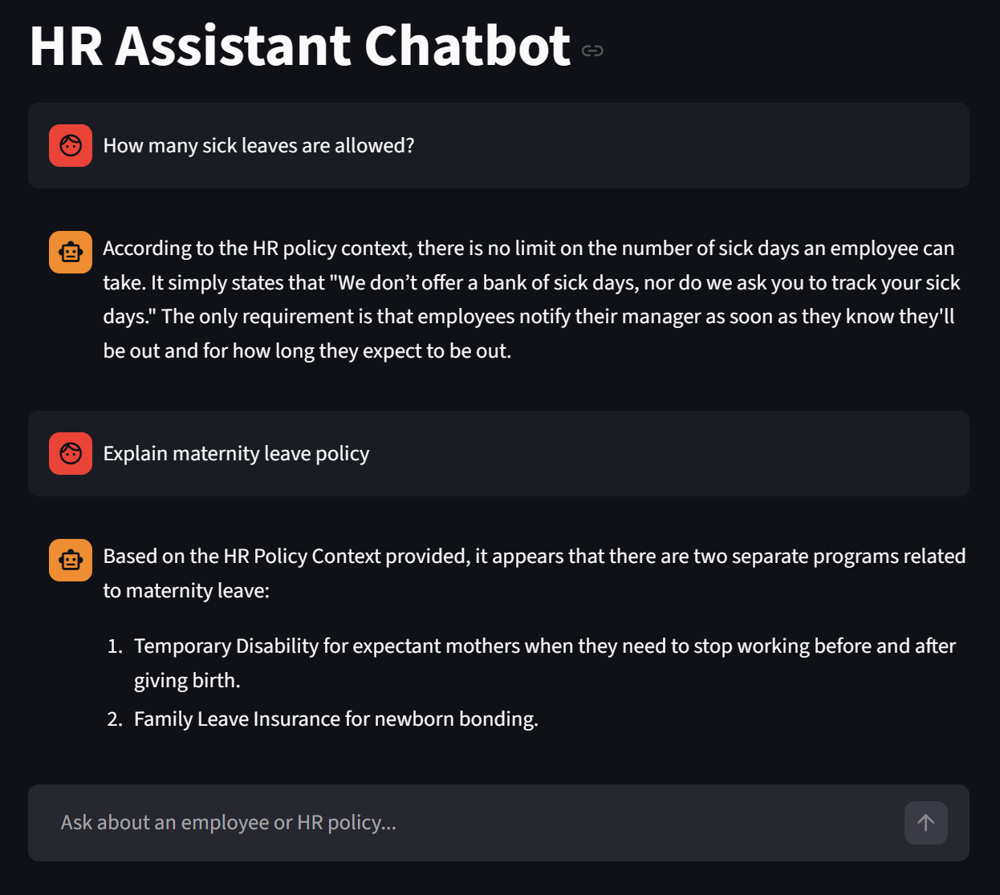

🤖 HR Assistant Chatbot

An AI-powered HR Assistant Chatbot that helps employees and candidates with HR-related queries such as leave policies, company guidelines, onboarding steps, and more.




```bash
python run_app.py
```

User can ask question -

How many sick leaves are allowed?
Explain maternity leave policy
What is the notice period?
what are Medical and Family Leave for California?
what are Medical and Family Leave for Massachusetts resident
